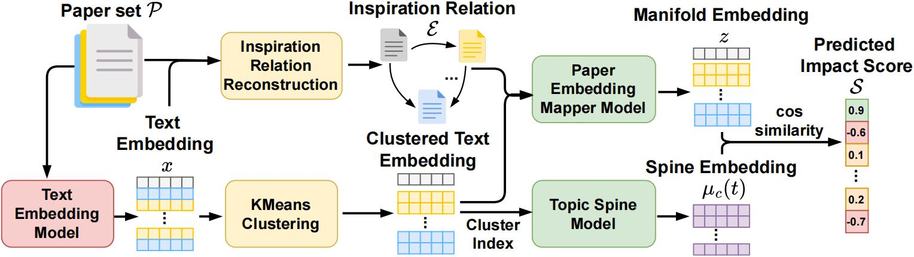

<div align="center">
  <h2><b>FAME: Forecasting Academic Impact via Continuous-Time Manifold Evolution</b></h2>
  <h4><b>Jianrong Ding, Jianyuan Zhong, Zhengyan Shi, Qiang Xu†</b></h4>

[](https://arxiv.org/abs/2605.07208)

</div>
<br>



## Quick Start

### Environment

- Python `>=3.10`
- Install dependencies with `uv`:

```bash
uv sync
```

### Configure API keys (optional but recommended)

Create a `.env` file in the repo root:

```env
# Core LLM / embedding
OPENAI_API_KEY=...

# Optional model overrides
OPENAI_EVAL_MODEL=gpt-4.1
OPENAI_INSPIRE_MODEL=gpt-4.1-mini
OPENAI_CLUSTER_MODEL=gpt-4.1-mini

# Optional custom API endpoints
OPENAI_BASE_URL=
GOOGLE_BASE_URL=

# Optional external impact signals
SEMANTIC_SCHOLAR_API_KEY=
ALTMETRIC_API_KEY=
ALTMETRIC_SECRET=
```

If keys are missing, parts of the pipeline fall back to heuristic behavior.

## Main Commands

### Fetch topic data

Runs arXiv retrieval, embedding, clustering, inspiration detection and impact collection.

```bash
uv run python fetch_data.py \
  --topic "time series forecasting" \
  --max-results 50 \
  --since-year 2018 \
  --cluster-count 8 \
  --seed 42 \
  --embedding-model text-embedding-3-large
```

Outputs are stored under `data/<topic>/`.

### Run frontier prediction

Trains on papers before cutoff month, evaluates papers in the next `--eval-months` window.

```bash
uv run python predict_frontier.py "time series forecasting" \
  --cutoff 2024.06 \
  --eval-months 2 \
  --cluster-count 8 \
  --method llm \
  --eval-model gpt-4.1
```

Use our manifold model:

```bash
uv run python predict_frontier.py "time series forecasting" \
  --cutoff 2024.06 \
  --eval-months 2 \
  --epochs 400 \
  --device cuda \
  --cluster-count 8 \
  --method manifold
```

Results are written to `frontier_result/<topic>/`.


